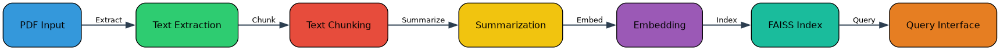
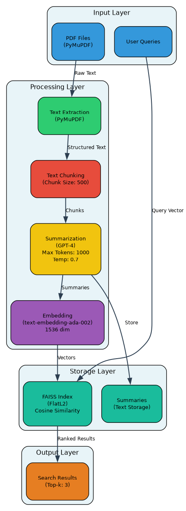
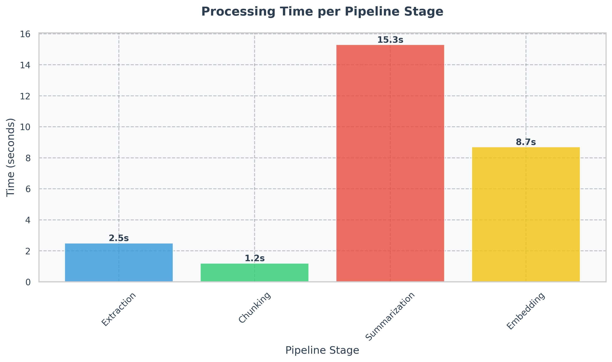

# distiller 🎯
Open source information store RAG pipeline fine-tuned for textbook PDF files

## Overview 📚
Distiller is a powerful Retrieval Augmented Generation (RAG) pipeline designed specifically for processing and querying textbook PDFs. It extracts, processes, and indexes textbook content for efficient information retrieval and question answering.

### RAG Pipeline Visualization

*Distiller's RAG pipeline architecture showing the flow from PDF input to query interface*

## Features ✨
- 📄 PDF Text Extraction with PyMuPDF
- 🔍 Intelligent Text Chunking
- 🤖 GPT-4 Powered Summarization
- 🧮 Efficient Vector Embeddings
- 🔎 Fast FAISS Index Search
- 💡 Natural Language Querying

## Architecture 🏗️

*Detailed system architecture showing component interactions and data flow*

## Performance ⚡

*Performance benchmarks across different pipeline stages*

## Installation 🛠️

### Using Conda
```bash
conda create -n distiller python=3.9
conda activate distiller
pip install -r requirements.txt
```

### Using pip
```bash
python -m venv venv
source venv/bin/activate  # On Windows: venv\Scripts\activate
pip install -r requirements.txt
```

## Usage 🚀
1. Extract text from PDF:
```bash
python src/extract.py
```

2. Chunk the extracted text:
```bash
python src/chunk.py
```

3. Generate summaries:
```bash
python src/summarize.py
```

4. Create embeddings and index:
```bash
python src/embeddings.py
```

5. Query the knowledge base:
```bash
python src/retriever.py
```

## Project Structure 📁
```
distiller/
├── config/         # Configuration files
├── data/          # Input PDF files
├── outputs/       # Generated outputs
├── src/           # Source code
├── tests/         # Test files
└── visualizations/# Generated diagrams
```

## Configuration ⚙️
Key configuration options in `config/config.yaml`:
- Chunk size
- Model parameters
- Embedding dimensions
- Number of results (k)

## License 📝
This project is licensed under the MIT License - see the LICENSE file for details.

## Roadmap 🗺️
- [ ] Support for multiple PDF formats
- [ ] Improved chunking algorithms
- [ ] Additional embedding models
- [ ] Web interface for querying
- [ ] Batch processing support 
